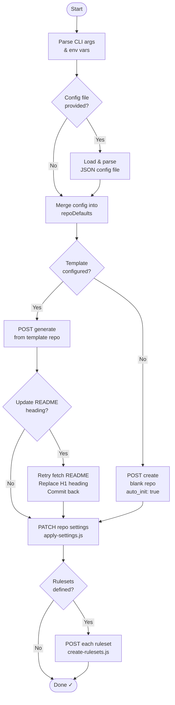

# repository-create

A Node.js CLI that uses [Octokit.js](https://github.com/octokit/octokit.js) to
dynamically create a GitHub organization repository and apply a pre-defined set
of general settings and branch rulesets.

Supports blank creation or generation from a template repository.

> **Future state:** authentication is designed to be swapped from a Personal
> Access Token (PAT) to a GitHub App — see [`src/github-client.ts`](src/github-client.ts).

## Project structure

> [!NOTE]
> `tree -a -F -L 3 -I '.git|.vscode' --gitignore --dirsfirst .`

```none
.
├── .github
│   ├── workflows
│   │   ├── pre-commit.yaml         # Runs pre-commit hooks on pull requests
│   │   ├── publish.yaml            # Creates GitHub release from a tag
│   │   ├── release.yaml            # Semantic release on push to main
│   │   └── test.yaml               # Validates dist/ build on pull requests
│   └── .dependabot.yml
├── config
│   ├── config.json                 # Standard config
│   ├── config.noinit.json          # Minimal config with no template and no auto_init
│   └── config.default.json         # Sample default config with all options specified
├── dist
│   ├── index.js                    # Bundled action entrypoint (committed, auto-generated)
│   └── index.map.js                # Bundled action entrypoint sourcemap (committed, auto-generated)
├── src
│   ├── action.ts                   # GitHub Actions entrypoint (uses @actions/core)
│   ├── apply-settings.ts           # PATCH general repo settings after creation
│   ├── create-repository.ts        # Orchestrator: create → settings → rulesets
│   ├── create-rulesets.ts          # POST branch rulesets
│   ├── github-client.ts            # Octokit client factory (PAT today, App-ready)
│   ├── index.ts                    # CLI entry point
│   ├── repo-defaults.ts            # Default repo settings and branch ruleset config
│   ├── types.ts                    # Shared TypeScript type definitions
│   └── update-readme.ts            # Updates README heading after template creation
├── .pre-commit-config.yaml         # Pre-commit configuration
├── .releaserc                      # Semantic release configuration
├── action.yaml                     # JavaScript action definition
├── CHANGELOG.md
├── CONTRIBUTING.md
├── env.sample
├── eslint.config.mjs
├── LICENSE
├── package-lock.json
├── package.json
├── README.md
└── tsconfig.json
```

## Prerequisites

- Node.js 24 or later
- A GitHub Personal Access Token with the following scopes:
  - `repo` — full repository access
  - `admin:org` — required to create repos in an organization and manage rulesets

## Usage

### GitHub Actions (recommended)

#### Use as an action from another workflow

```yaml
- name: Create repository
  uses: stairwaytowonderland/repository-create@main
  with:
    github-token: ${{ secrets.PAT }}
    # org: ${{ github.org }}          # optional — github.org is default; input shown for reference
    name: my-new-repo
    repo-config: config/config.json   # optional
    visibility: private               # optional — private | internal | public (default)
    job-summary: true                 # optional — write a job summary (default: true)
```

#### Action inputs

| Input                  | Required | Description                                                                                                          |
| ---------------------- | -------- | -------------------------------------------------------------------------------------------------------------------- |
| `github-token`         | Yes      | Token with `repo` + `admin:org` scopes                                                                               |
| `org`                  | Yes      | Target GitHub organization                                                                                           |
| `name`                 | Yes      | Repository name to create                                                                                            |
| `repo-config`          | No       | Path to JSON override file (relative to workspace root)                                                              |
| `visibility`           | No       | Repository visibility: `private`, `internal`, or `public`. Overrides `repo-config` if set. `internal` requires GHEC. |
| `template-owner`       | No       | Owner of the template repository                                                                                     |
| `template-repo`        | No       | Name of the template repository                                                                                      |
| `include-all-branches` | No       | Copy all template branches (default: `false`)                                                                        |
| `job-summary`          | No       | Write a job summary to the Actions step summary (default: `true`)                                                    |

#### Action outputs

| Output      | Description                                      |
| ----------- | ------------------------------------------------ |
| `repo-url`  | HTML URL of the created repository               |
| `repo-name` | Full name of the created repository (`org/repo`) |
| `repo-id`   | Numeric ID of the created repository             |

### Configuration

[`src/repo-defaults.ts`](src/repo-defaults.ts) contains the default
repository settings and branch ruleset configuration. You can override any of
these values at runtime by passing a JSON config file.

#### Minimal config

```jsonc
// Example minimal config (e.g. config.json) using default options
{
    "settings": {
        "description": "Reality is merely an illusion, albeit a very persistent one - Albert Einstein",
        "visibility": "private",
        "template": {
            "owner": "stairwaytowonderland",
            "repo": "repository-template"
        }
    }
}
```

#### Full config

```jsonc
// Example config (e.g. config.json) with all options specified
{
    "settings": {
        "description": "",
        "visibility": "public",
        "hasIssues": true,
        "hasProjects": false,
        "hasWiki": false,
        "allowSquashMerge": true,
        "allowMergeCommit": false,
        "allowRebaseMerge": false,
        "squashMergeCommitTitle": "PR_TITLE",
        "squashMergeCommitMessage": "PR_BODY",
        "deleteBranchOnMerge": true,
        "allowAutoMerge": false,
        // auto_init is ignored if "template" is set
        "auto_init": true,
        // "template": {
        //     "owner": "{owner}",
        //     "repo": "{repo}"
        // }
    },
    "rulesets": [
        {
            "name": "main-branch-protection",
            "target": "branch",
            "enforcement": "active",
            "conditions": {
                "ref_name": {
                    "include": ["refs/heads/main"],
                    "exclude": []
                }
            },
            "rules": [
                {
                    "type": "pull_request",
                    "parameters": {
                        "allowed_merge_methods": ["squash"],
                        "required_approving_review_count": 1,
                        "dismiss_stale_reviews_on_push": true,
                        "require_code_owner_review": false,
                        "require_last_push_approval": true,
                        "required_review_thread_resolution": true
                    }
                },
                { "type": "required_linear_history" },
                { "type": "deletion" },
                { "type": "non_fast_forward" }
            ],
            "bypass_actors": []
        }
    ]
}
```

### CLI Usage

#### Installation

```bash
npm install
```

| Variable       | Description                                                   |
| -------------- | ------------------------------------------------------------- |
| `GITHUB_TOKEN` | Personal Access Token (see Prerequisites above)               |
| `GITHUB_ORG`   | Target GitHub organization                                    |
| `REPO_NAME`    | Repository name to create (optional fallback)                 |
| `REPO_CONFIG`  | Path to a JSON override file (alternative to `--repo-config`) |

> [!NOTE]
> **Local development**
>
> Copy `env.sample` to `.env` and fill in your values:
>
> ```bash
> cp env.sample .env
> ```

#### Examples

```bash
# Using environment variables (recommended for npm start)
GITHUB_TOKEN=ghp_... GITHUB_ORG=my-org REPO_NAME=my-repo npm start

# With a config override file via env var
GITHUB_TOKEN=ghp_... GITHUB_ORG=my-org REPO_NAME=my-repo REPO_CONFIG=./config/config.json npm start
```

Or invoke `node` directly to use CLI flags (avoids npm flag-parsing warnings):

```bash
# With CLI flags
GITHUB_TOKEN=ghp_... node --import tsx/esm src/index.ts --org my-org --name my-repo

# With a config override file
GITHUB_TOKEN=ghp_... node --import tsx/esm src/index.ts --org my-org --name my-repo --repo-config ./config/config.json

# From a template repository
GITHUB_TOKEN=ghp_... node --import tsx/esm src/index.ts --org my-org --name my-repo \
  --template-owner my-org --template-repo my-template-repo

# Include all template branches (default: only the default branch is copied)
GITHUB_TOKEN=ghp_... node --import tsx/esm src/index.ts --org my-org --name my-repo \
  --template-owner my-org --template-repo my-template-repo --include-all-branches
```

The template can also be set in a config override file:

```jsonc
// my-config.json
{
  "settings": {
    "template": {
      "owner": "my-org",
      "repo": "my-template-repo",
      "includeAllBranches": true
    }
  }
}
```

## Default settings

| Setting                | Default    |
| ---------------------- | ---------- |
| Visibility             | `public`   |
| Issues                 | enabled    |
| Projects               | disabled   |
| Wiki                   | disabled   |
| Allow squash merge     | enabled    |
| Allow merge commit     | disabled   |
| Allow rebase merge     | disabled   |
| Squash commit title    | `PR_TITLE` |
| Squash commit message  | `PR_BODY`  |
| Delete branch on merge | enabled    |
| Auto-merge             | disabled   |
| Template               | none       |

### Default branch ruleset (`main-branch-protection`)

| Rule                          | Value         |
| ----------------------------- | ------------- |
| Allowed merge methods         | `squash` only |
| Required approving reviews    | 1             |
| Dismiss stale reviews on push | enabled       |
| Require code owner review     | disabled      |
| Require last-push approval    | enabled       |
| Resolve all threads           | enabled       |
| Require linear history        | enabled       |
| Prevent branch deletion       | enabled       |
| Prevent force pushes          | enabled       |
| Bypass actors                 | none          |

## What this action does



1. **Load configuration** — merges built-in defaults with an optional JSON override file (`repo-config`).
Action inputs (`visibility`, `template-*`, etc.) take precedence over the config file.
2. **Create the repository** — either generates from a template repository (if `template-owner` and `template-repo` are
set) or creates a blank repository with `auto_init: true`.
3. **Update README heading** — if created from a template, replaces the first H1 in the new repository's README with the
repository name (can be disabled via config).
4. **Apply settings** — patches the repository with the full settings payload (visibility, merge strategies, branch
deletion, etc.) in a second-pass API call to cover fields not available at creation time.
5. **Create branch rulesets** — POSTs each configured ruleset (e.g. `main-branch-protection`) to the repository.
6. **Write job summary** — outputs a summary with the repository URL, name, and triggering actor (can be disabled with
`job-summary: false`).
